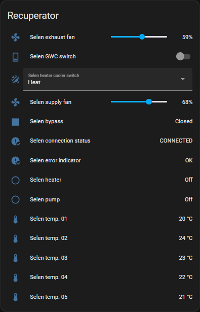

# Berluf Selen 2 integration for Home Assistant
Integration for controlling recuperator Berlf Selen 2 via Home Assistant, instead of a touchpanel panel.

**Integration cannot be used with recuperator's touchpanel.**
Currently integration supports a connection with recuperator only via a RS485 to USB converter.
A converter has to be plugged in insted of the touchpanel.

## Current features
- connection with recuperator via RS485 -> USB converter,
- controls:
    - supply fan control,
    - exhaust fan control,
    - GWC,
    - heating/cooling mode,
- sensors:
    - bypass,
    - heater,
    - pump,
    - thermometers (all, 1-5),
    - error signalizer (original error codes: P1, P2, E1-E8),
    - connection status (status of a physical connection with converter).

## Installation

### Install manually

To install this integration manually, create a "custom_components" folder in the same directory, where "configuration.yaml" file is located.
Finally copy the "[berluf_selen_2](./custom_components/berluf_selen_2)" folder from this repository to previously created "custom_components" directory.

After the steps above, the integration is ready for setup.

## Setup
1. In Home Assitant choose `Configuration` tab.
1. Click on `Devices & Services`.
1. Click on `+ Add integration` button.
1. Search for and select `Berluf Selen 2`.
1. In the integration configuration window, choose fan values conversion if needed:
    - `OFF` - default, no conversion is used (fan speed control works just as in the original touchpanel - fans start to rotate when set to minimum 10% speed),
    - `LINEAR` - 0% of the fan speed correcponds to 8% in the original (max speed when no fan rotation is observed); 99% (max rotation) corresponds to 99% in the original (conversion via linear function, less precise, as calculated, non-integer values are converted to the nearest integer).
1. Select a type of a physical connection that will be used to connect to the recuperator, currently only `SERIAL` supported (e.g. RS485 to USB converter).
1. Click `SUBMIT`.
1. Type a name of the converter's serial port (e.g. "*/dev/ttyUSB1*").
1. Click `SUBMIT`.
1. Recuperator should be ready to be controlled via Home Assistant.